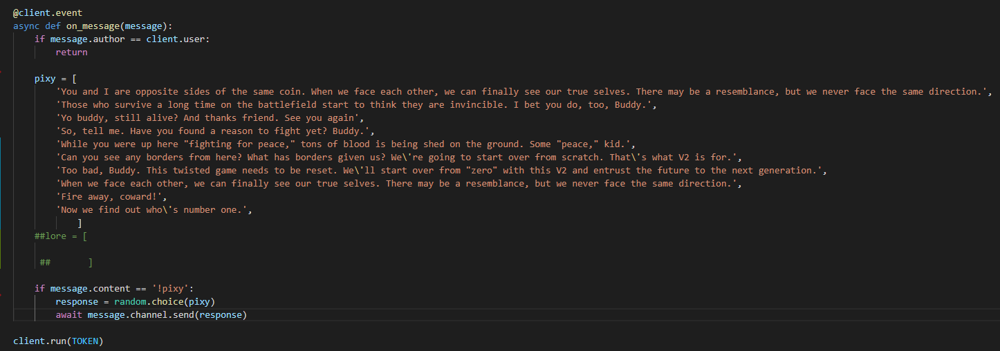
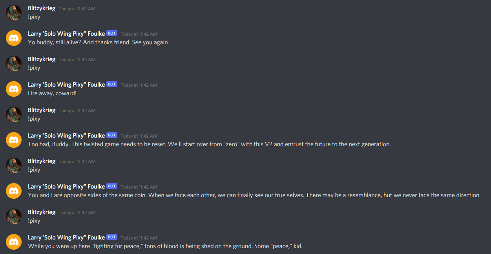
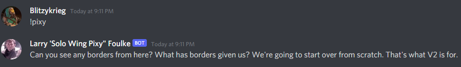

# Project 2 Documentation

## Setup

How to get the API/ Where to put it to work with the code / dependancies

On the Discord Development portal you go to the tab where information on the bot you created is stored and look for the section called "Token" on your bot's page. In that section you will find a button that says "Copy" which will copy your API into your clipboard without showing what it actually is. In the bot.py folder you could simply put your Token where the code asks for it but that would be a huge security flaw. For this lab instead we  created a separate folder simply named ".env" which is supposed to be locally stored on any machine you plan to run that bot from and never put onto a public repository (I am pretty sure I managed to avoid doing this!). In this .env file is where we will store the Token you copied from your Bot page. All that needs to be included in this file is this line of code: DISCORD_TOKEN={Your token}. So where you would normally include your Token in bot.py you would instead put DISCORD_TOKEN. On it's own this should not work but if you install the library called "dotenv" by using the command "pip install -U python-dotenv" in your terminal. By installing this library, when you run the program it should automatically know to look for the .env file if it is in the same directory as your bot.py file and will know to instead replace the DISCORD_TOKEN with your Token automatically when you run the program without ever having to save it directly in your python script. Another package I needed to install was discord.py which impliments Discord's API.

## Usage

So to make this bot truly mine I got rid of all the commands already created for it and replaced them with my own. To follow along with the theme of using quotes from certain characters I chose to go with my current go-to person to quote which is some guy from an Ace Combat game named "Pixy". I created a value called "pixy" and created a list of potential quotes the bot will say when I command it to. In the if statement I told it to pick a random quote from the list and post it as a message whenever someone types "!pixy" in the Discord server it is part of.

Here is the code in python:

Here is the commands in action:

I actually also wanted to add images as an option to be shown when someone used the command !pixy put unfortunately I could not get that to work. The closest I was able to get was this:

I did some outside research before I had to go to work to try and figure this out but unfortunately I ran out of time. I eventually plan to continue adding more commands and the ability for images to be shown on my own time for my own use because I actually enjoyed creating this.

Since the command that I needed to run actually worked though I continued on and settled for just changing the Bot's profile picture to the character which will suffice for now.

## Research

What I noticed when I was running this python scipt is that it never actually ended until I either killed the terminal or exited out of visual studio code. Prior to doing some outside research I assumed the easiest the solution would be to simply have a computer that is always on running the script. Upon doing some research I found out I was actually correct! While running it on a physical computer like an old laptop or even a raspberry pi and leaving it always on is a potental solution to the problem. Another way to run the bot 24/7 would be to remotely host the bot through the cloud. There seem to be many websites that offer hosting services such as AWS, Digital Ocean, OVHcloud, or Vultr. Using a virtual private server does seem to be a more practical solution for something like this.
