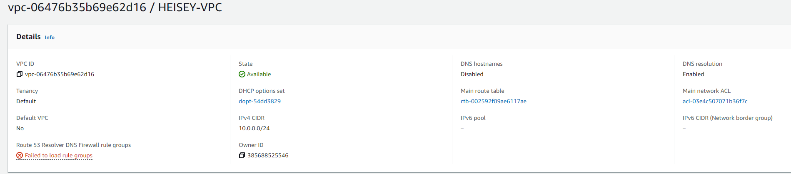
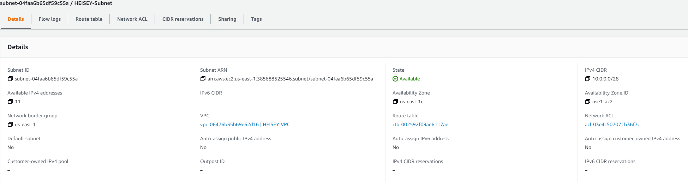
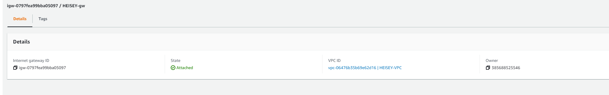
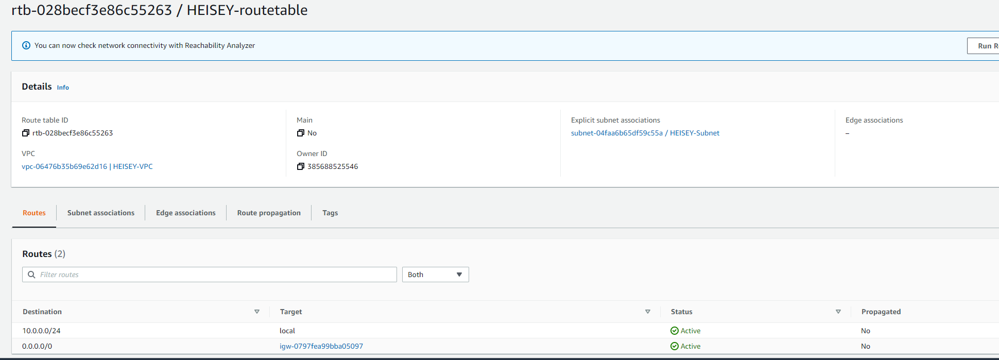
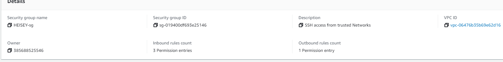
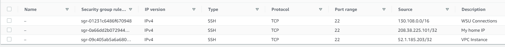
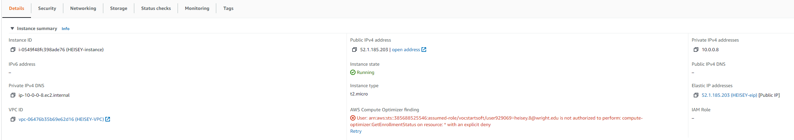
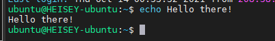

# Project 3

## Part 1 - Build a VPC

1. Create VPC  
I created a VPC as per the requirements giving it the tag HESIEY-VPC and the private IP address range 10.0.0.0/24 to give the VPC its range of addreses. I am essentially creating the network layer for instances in AWS.  

2. Create a subnet  
I created a subnet named HEISEY-Subnet with the IP address range of 10.0.0.0/28 which will truncate the amount of IPv4 addresses available even more within the VPC. The subnet is the range of IP addresses.   

3. Create an internet gateway  
I created a gate named HEISEY-gw which will be the thing that connects my VPC to the outside world.  

4. Create a route table  
I created a route table called HEISEY-routetable which will determine where network traffic is directed  

5. Create a security group which determines who is allowed to SSH into the created instance.    
Here is the Security Group
  
Here is the inbound rules I created  

## Part 2 - EC2 instances

1. AMI selected: Ubuntu Server 20.04 LTS (HVM), SSD Volume Type  
    Username: ubuntu

2. Attach the instance to your VPC: In the configure instance details options menu I had the option to select my VPC that I created under the Network tab so that is what I did.

3. Determine whether a Public IPv4 address will be auto-assigned to the instance.  
    I picked to not auto assign an IPv4 address because it is something I am going to have to manually to later anyways, and it's the free option.

4. Attaching volume. I left the settings there to a default 8gb I figured it was enough for this projects purposes

5. Tagging Instance. I gave my instance the tag HEISEY-instance to follow the projects naming scheme.

6.  Associate your security group. In the security groups option since I had already attached this instance to my VPC the security groups option I had created what available to chose from. I chose it.

7. Reserve an Elastic IP address and associate it. After I allocated my EIP which I name HEISEY-eip I then hit the actions menu which gave me the option to associate it. In that menu I was then able to select the instance I create and then hit the associate button.

8. Screenshot of instance  

9. SSH into instance and change hostname. I ssh'd into my instance the same way I would with the other instances I played around with by running the command 'ssh -i ceg3120-aws-vm.pem ubuntu@52.1.185.203' then to change the hostname I copied the old hostname by doing 'sudo cp hostname hostname.old' and entered the command 'sudo hostnamectl set-hostname HEISEY-ubuntu' and restarted my instance.

10. Screenshot of ssh connection  
