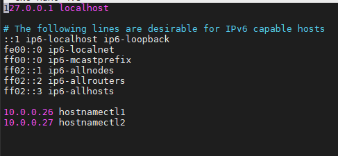
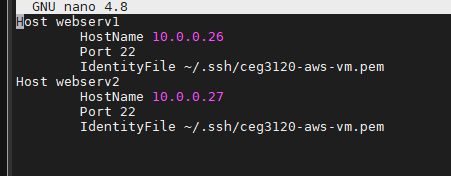
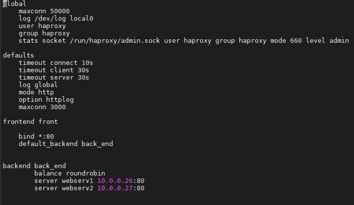
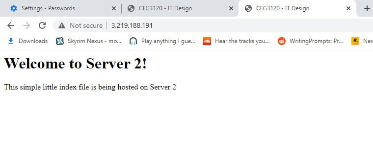

# Project 5

## Part 2

1. Create an /etc/hosts file on each system that correlates hostnames to private IPs.
    Description of how file is configured  
    The host file is configured by entering an IP address then the host name. Here's an example of my hosts file from my proxy instance:  
      
    I am honestly not sure if I did this part correctly. Everything else in this project seemed to have worked with my hosts file looking like this. My other two instances have similar looking hosts files.  

2. Document how to SSH in between the systems utilizing their private IPs.  
    For this I went into my /.ssh folder and created a file called config. Inside this folder  
    I added this information:  
  
    This config file was made for my proxy instance. The .pem file which contains my private key   
    did not originally exist on this instance, I manually created the file and copied the text from my host  
    machine to my proxy instance then gave it the proper permissions with chmod 400. By doing that  
    I was able to ssh to each instance within another instance once I created the same config folder and .pem for my other two instances.  

3. HAProxy configuration & documentation requirements  
    * Installation: 
        To install HAproxy you enter the command 'apt-get install -y git haproxy'
    * Files Modified: haproxy.cfg
    * Configuration: haproxy.cfg was the only file I had to configure here's a picture of  
      what it looks like:  
        
    * Restart Service: sudo systemctl restart haproxy.service  
    * Resources used:  
        https://www.digitalocean.com/community/tutorials/an-introduction-to-haproxy-and-load-balancing-concepts  
        https://www.haproxy.com/blog/the-four-essential-sections-of-an-haproxy-configuration/

4. Apache2 configuration & documentation requirements
    * Installation
        To install apache2 you enter the command 'sudo apt install -y apache2 '
    * Files Modified: index.html changed to look like index.srv1.html
    * Configuration: I when into apache2.conf to set the ServerName
    * Restarting: sudo service apache2 reload
    * Resources used:  
            https://www.digitalocean.com/community/tutorials/how-to-install-the-apache-web-server-on-ubuntu-20-04  
            https://ubuntu.com/tutorials/install-and-configure-apache#1-overview  
            https://unix.stackexchange.com/questions/155150/where-in-apache-2-do-you-set-the-servername-directive-globally
4.  nginx configuration & documentation requirements
    * Installation
        To install nginx you enter the command 'sudo apt install nginx'
    * Files Modified: index.nginx-debian.html changed to look like index.srv2.html
    * Configuration: I have not needed to configure any files.
    * Restarting: sudo systemctl restart nginx
    * Resources used:  
          https://www.digitalocean.com/community/tutorials/how-to-install-nginx-on-ubuntu-20-04  
5. From the browser, when connecting to the proxy server, take two screenshots.
    * Server 1:  
        
    * Server 2:  
        

6. Link to Proxy: http://3.219.188.191/